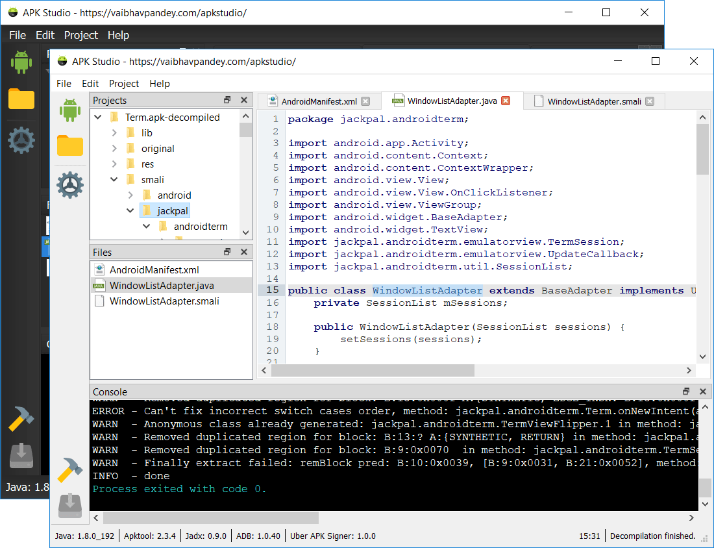

<h1 align="center">
  <a href="http://www.vaibhavpandey.com/apkstudio/">
    
  </a>
  <br>
  APK Studio
</h1>

Open-source, cross platform [Qt6](https://www.qt.io/) based IDE for reverse-engineering [Android](https://android.com/) application packages. It features a friendly IDE-like layout including code editor with syntax highlighting support for \*.smali code files.

[](resources/screenshot.png)

<p align="center">
  <a href="https://github.com/vaibhavpandeyvpz/apkstudio/actions">
    
  </a>
  <a href="https://github.com/vaibhavpandeyvpz/apkstudio/releases/latest">
    
  </a>
  <a href="https://github.com/vaibhavpandeyvpz/apkstudio/releases">
    
  </a>
  <a href="https://github.com/vaibhavpandeyvpz/apkstudio/blob/master/LICENSE">
    
  </a>
</p>

### Features

- Cross platform, run on **Linux**, **Mac OS X** & **Windows**
- Decompile/recompile/sign & install APKs
- **Automatic tool download & installation** - APK Studio can automatically download and install required tools (Java, Apktool, JADX, ADB, Uber APK Signer)
- **Framework support** - Install and use manufacturer-specific framework files (e.g., HTC, LG, Samsung) with optional tagging for decompiling and recompiling APKs
- **Command-line APK opening** - Open APK files directly from the file system via "Open with" context menu or command-line arguments
- **Extra apktool arguments** - Provide additional command-line arguments (e.g., `--force-all`, `--no-res`) for decompile and recompile operations
- **Search functionality** - Quick search in open files and project tree to find items by name
- Built-in code editor (\*.java; \*.smali; \*.xml; \*.yml) w/ syntax highlighting
- Built-in viewer for image (\*.gif; \*.jpg; \*.jpeg; \*.png) files
- Built-in hex editor for binary files
- **Dark/Light theme support** - Native Qt 6 theming with system integration

### Downloads

Please head over to [Releases](https://github.com/vaibhavpandeyvpz/apkstudio/releases) page for downloading.

**Note:** APK Studio can automatically download and install required tools (Java, Apktool, JADX, ADB, Uber APK Signer) on first launch. If you prefer to use your own installations, you can configure them in Settings.

**Tip:** You can open APK files directly from your file system by right-clicking an `.apk` file, selecting "Open with" → "Choose an app on your PC" (or "Choose another app"), then browsing to the APK Studio executable. Alternatively, you can pass the APK file path as a command-line argument. The decompile dialog will automatically open with the selected file.

### Building

#### Requirements

- **CMake** 3.16 or higher
- **Qt6** 6.10.1 or higher (Core, Gui, Network, Widgets components)
- **C++17** compatible compiler
- **Git** (for version information)

#### Build Instructions

1. **Clone the repository** (including submodules):
   ```bash
   git clone --recursive https://github.com/vaibhavpandeyvpz/apkstudio.git
   cd apkstudio
   ```

2. **Configure the build**:
   ```bash
   cmake -B build -S . -DCMAKE_BUILD_TYPE=Release
   ```
   
   On macOS, you may need to specify the Qt path:
   ```bash
   cmake -B build -DCMAKE_BUILD_TYPE=Release -DCMAKE_PREFIX_PATH=/path/to/Qt/6.10.1/clang_64
   ```

3. **Build the project**:
   ```bash
   cmake --build build --config Release
   ```

4. **Deploy Qt dependencies** (optional, for distribution):
   - **Windows**: Use `windeployqt` from Qt installation
   - **Linux**: Use `linuxdeploy` with Qt plugin to create AppImage
   - **macOS**: Use `macdeployqt` to bundle Qt frameworks

The executable will be located at:
- **Windows**: `build/bin/Release/ApkStudio.exe`
- **Linux/macOS**: `build/bin/ApkStudio` (or `build/bin/ApkStudio.app` on macOS)

#### CI/CD

The project uses GitHub Actions for automated builds on Windows, Linux, and macOS. Build artifacts are automatically created and uploaded on every push, pull request, and release.

### Credits

- [iBotPeaches](https://github.com/iBotPeaches) for [apktool](https://ibotpeaches.github.io/Apktool)
- [patrickfav](https://github.com/patrickfav) for [uber-apk-signer](https://github.com/patrickfav/uber-apk-signer)
- [skylot](https://github.com/skylot) for [jadx](https://github.com/skylot/jadx)
- [linuxdeploy](https://github.com/linuxdeploy/linuxdeploy) team for [linuxdeploy](https://github.com/linuxdeploy/linuxdeploy) and [linuxdeploy-plugin-qt](https://github.com/linuxdeploy/linuxdeploy-plugin-qt)
- [Antonio Davide](https://github.com/Dax89) for [QHexView](https://github.com/Dax89/QHexView)
- [p.yusukekamiyamane](https://p.yusukekamiyamane.com/) for [Fugue](https://p.yusukekamiyamane.com/) icons
- [Icons8](https://icons8.com/) for various icons
- [Surendrajat](https://github.com/Surendrajat) for maintaining project while I couldn't

**Note**: If you encounter any problems, make sure to check **Console** output at the bottom of the IDE to get the output of command which was actually executed by program. Report any issues related to APK Studio [here](https://github.com/vaibhavpandeyvpz/apkstudio/issues) on Github. Please note, an issue with [apktool](http://ibotpeaches.github.io/Apktool/) is not an issue with **APK Studio**. Please verify the context of issue before opening a ticket.

---

##### Disclaimer

Same as [apktool](http://ibotpeaches.github.io/Apktool/), **APK Studio** is neither intended for piracy nor other non-legal uses. It could be used for localizing, adding some features or support for custom platforms, analyzing applications &amp; much more.
